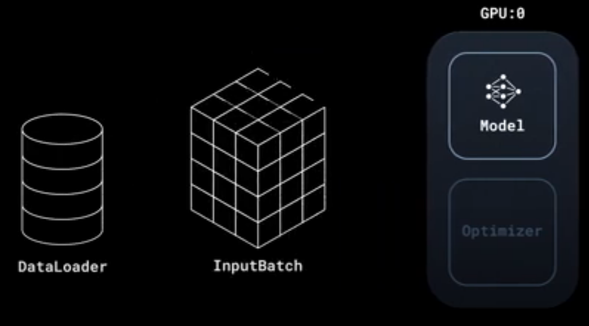
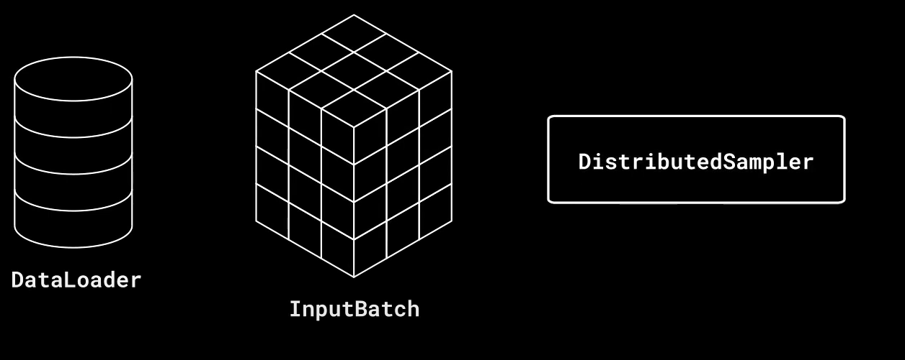
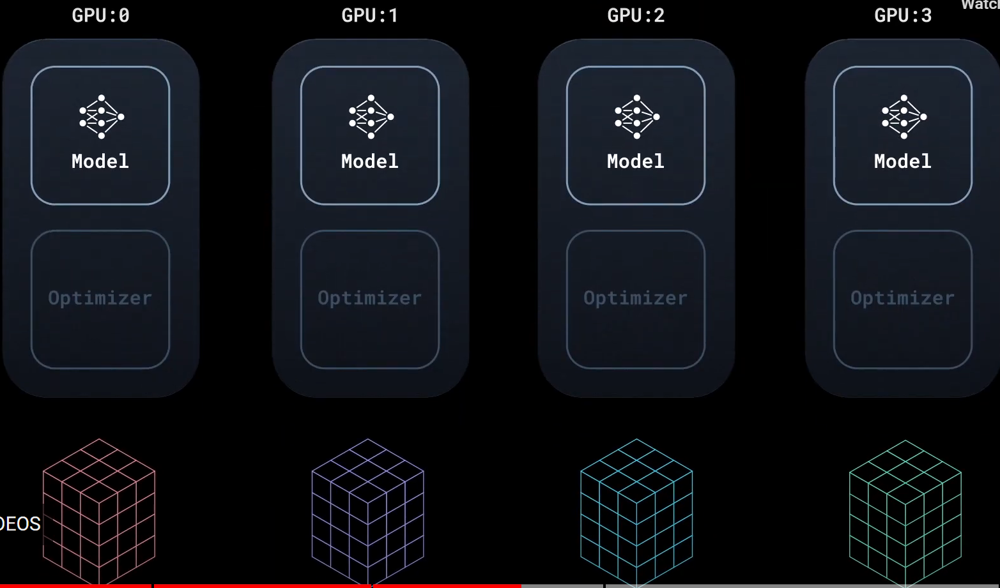
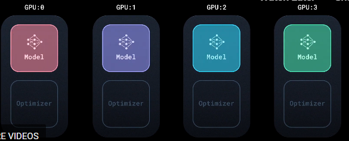
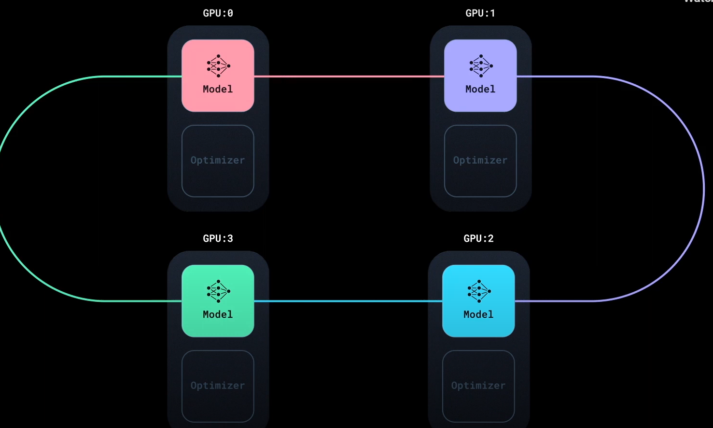
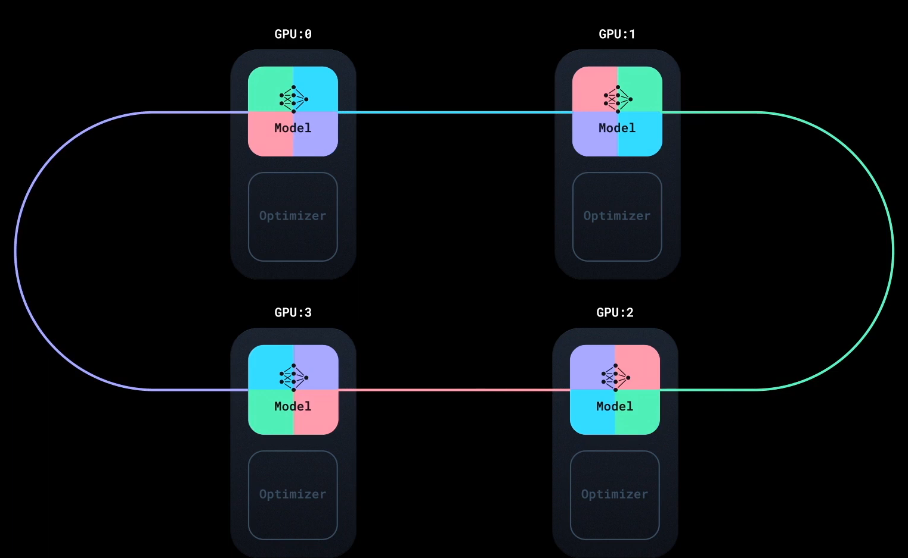
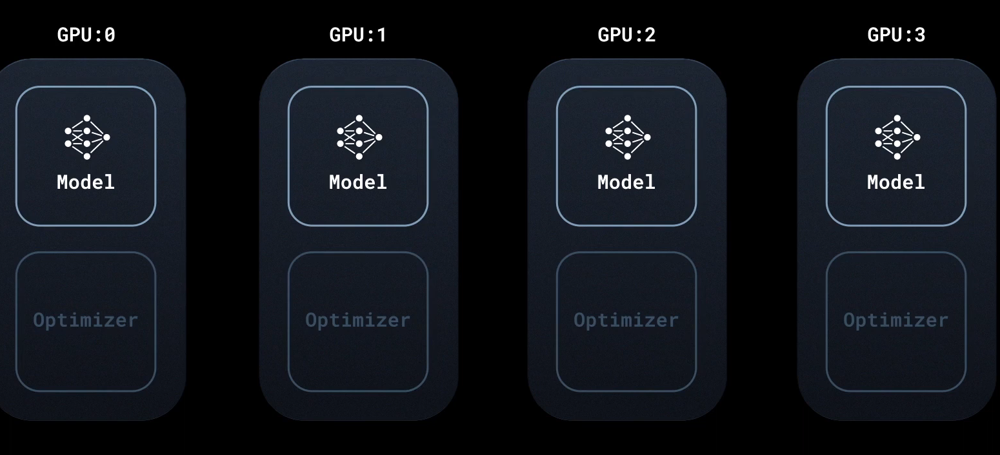
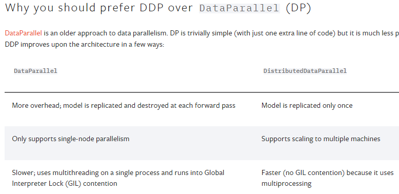

Why Distributed Training of Models ?
1. Saves time
2. Increase the amount of compute
3. Helps to train model faster

As model became large and larger over time we was't able to fit it one single GPU machine thus we need the distributed training via model parallel and FSDB

Start non-distributed training job
Scaling-up
1. Multiple GPU on one machine
2. Multiple machine on cluster
End deploying a training job across several machines in a cluster.
How DDP can we use to train our LLM model faster ?

How DDP works under the hood

What is DistributedSampler

How gradients are synchronized across GPUs

What is procedure of model training on non-distributed systems  ?

Start with 
1. Model takes InputBatch of Data from DataLoader
2. Pass it to forward pass to model to calculate the error(loss) and backward pass to compute parameters of gradients which optimizer uses to update the model.

What is procedure of model training on distributed systems ?
0. Distributing training jobs to 4 GPU
1. DDP launches one process per GPU
2. each process has one local copy of model, each parameters, optimizers etc remains same on each process of model
3. DDP internally maintains the synchronization throughout the training process
4. each GPU has same model, we change the data such that each process takes different data input from input batch from dataloader

To do it, we use the DistributedSampler to distribute the equal amount of different data from same input batch to different GPU instances from model training. So, we are processing 4 time a data compared to single GPU

Feed the input to each model run the forward and backward pass to compute loss and gradient they are different on each GPU because data is different. When we run the optimizer, it will result the different parameters at same time across GPU devices which endup with distinct model instead of the single model.

Thus, DDP initiate the synchronization step, gradient from all replicas are aggreageted using Bucketed All reduced algorithms(It overlaps the gradient computation with communication)

means as we run the forward pass algorithms communicates with gradients on each machines which ensures that each machine running properly and at the end each model will have same replica.

Now we can run the optimizer on each instance of model for training it.

What is Distributed Data Parallel ?

PyTorch DistributedDataParallel (DDP) which enables data parallel training in PyTorch. Data parallelism is a way to process multiple data batches across multiple devices simultaneously to achieve better performance. In PyTorch, the DistributedSampler ensures each device gets a non-overlapping input batch. The model is replicated on all the devices; each replica calculates gradients and simultaneously synchronizes with the others using the ring all-reduce algorithm.

How to migrate a single-GPU training script to multi-GPU via DDP

Setting up the distributed process group

Saving and loading models in a distributed setup
how to use DDP in code. 
We will start with a single-GPU training script and migrate that to running it on 4 GPUs on a single node.