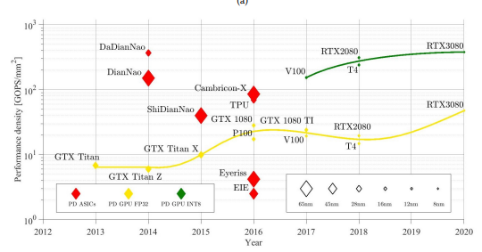

Artificial Intelligence (AI) systems hardware refers to the specialized and general-purpose computing components designed to enable and accelerate AI tasks such as model training, inference, and data processing. AI workloads often require intensive computation, parallel processing, and fast access to large datasets.

### Key Components of AI Systems Hardware:

- **Central Processing Units (CPUs):** General-purpose processors that handle a wide range of tasks, including AI control flow, data preprocessing, and running less complex AI models. CPUs excel at sequential processing but are less efficient than other hardware for large-scale deep learning.
- **Graphics Processing Units (GPUs):** Specialized for highly parallel operations, GPUs accelerate AI model training and inference, especially for deep learning involving vast matrix operations. They are widely adopted in AI research and applications due to their scalability and performance.
- **Tensor Processing Units (TPUs):** Custom AI accelerators developed by Google to optimize tensor operations common in deep learning. TPUs offer high efficiency and power for tasks like large-scale model training and are primarily accessible via cloud platforms.
- **Field-Programmable Gate Arrays (FPGAs):** Reprogrammable hardware that balances performance and flexibility, ideal for low-latency, real-time AI applications such as autonomous vehicles or trading systems.
- **Application-Specific Integrated Circuits (ASICs):** Custom-designed chips optimized for specific AI tasks. ASICs provide maximal efficiency and power savings but lack flexibility and require high development costs, suitable for large-scale or embedded AI deployments.
- **Memory and Storage:** Large amounts of RAM are crucial for handling AI data during computation, especially with large datasets and complex models. Fast storage solutions like NVMe SSDs enable rapid data access and processing.
- **Networking:** High-speed communication infrastructure is essential for distributed AI systems, facilitating data and computation sharing across clusters or edge devices and cloud servers.

### Considerations Based on AI Application:

- **Deep Learning:** Requires powerful GPUs or TPUs, large RAM, and fast storage to manage large datasets and complex model training.
- **Edge AI:** Needs energy-efficient, compact hardware like FPGAs or custom chips tailored for limited-resource devices.
- **High-Performance Computing (HPC) AI:** Uses clusters of CPUs, GPUs, and TPUs optimized for large-scale computations and research tasks.

### Summary Table of AI Hardware Types:

| Hardware Type | Strengths                                                 | Limitations                                          | Best Use Cases                              |
| ------------- | --------------------------------------------------------- | ---------------------------------------------------- | ------------------------------------------- |
| CPUs          | Versatile, good for sequential tasks, affordable          | Less efficient at parallel AI tasks, slower training | General purpose AI, preprocessing           |
| GPUs          | Excellent parallel processing, scalable, widely supported | High energy and cost                                 | Deep learning training, simulations         |
| TPUs          | Optimized for AI tensor operations, power-efficient       | Less flexible, mostly cloud-based                    | Large-scale deep learning on cloud          |
| FPGAs         | Customizable, low latency, energy-efficient               | Complex programming, lower raw performance           | Real-time AI, specialized low-latency tasks |
| ASICs         | Maximum performance and power efficiency                  | High development cost, inflexible                    | Large-scale specialized AI, embedded AI     |

AI hardware plays a foundational role in enabling AI algorithms and models to process data quickly and effectively, making it possible to deploy advanced AI applications across industries. Choosing the right hardware depends on the specific requirements of the AI workload, including scale, complexity, latency, and power constraints.

This overview provides a solid introduction to AI systems hardware and its critical importance in building and scaling AI solutions.

Here is a clear, summarized explanation based on your input and supported by authoritative sources:

### What is Artificial Intelligence?

John McCarthy, the father of AI, defined artificial intelligence as:
**“The science and engineering of making intelligent machines, especially intelligent computer programs. It is related to the similar task of using computers to understand human intelligence, but AI does not have to confine itself to methods that are biologically observable.”**

In essence, AI is about creating systems that can perform tasks requiring human-like intelligence such as learning, reasoning, problem-solving, and decision-making.

### Deep Learning vs. Machine Learning

- **Deep Learning:** Automates much of the feature extraction process, meaning the system automatically discovers the representations needed for detection or classification from raw data, minimizing human intervention. It uses neural networks with multiple layers to model complex patterns.
- **Classical Machine Learning:** Typically requires more human guidance to select and design features from data, relying on algorithms that learn from these features to perform tasks.

### Factors Driving AI Advancement

The growth and success of AI have been powered by the following:

- **Algorithmic Innovation:** New models, architectures, and methods that improve AI capabilities.
- **Data:** Availability of large datasets, both supervised (labeled) and interactive environments for training AI models.
- **Compute Power:** Increasing computational resources to train complex models efficiently, including GPUs, TPUs, and distributed computing systems.

This foundational understanding connects AI’s conceptual origins to practical modern advances in the field.

The computational needs for AI algorithms vary depending on the type, complexity, and scale of the tasks involved. Here are key points about the computation requirements for AI algorithms:

### Computation Needs for AI Algorithms

- **High Computational Cost:** AI algorithms, especially deep learning models, are computationally intensive. Training these models involves processing large datasets with millions or billions of parameters through numerous mathematical operations, often requiring powerful and specialized hardware like GPUs, TPUs, or large clusters of CPUs.
- **Time Complexity:** The amount of time taken by an AI algorithm to run depends on the algorithm design and input data size. Deep learning training can take hours, days, or even weeks depending on model complexity and hardware efficiency.
- **Space Complexity:** AI algorithms require significant memory storage during training and inference for data, intermediate calculations, and model parameters. This demands high RAM capacity and fast storage solutions like NVMe SSDs.
- **Parallel Processing:** Many AI algorithms benefit from parallel computing. GPUs and TPUs are designed to perform many operations simultaneously, drastically reducing training and inference time compared to traditional CPUs.
- **Iterative Training:** AI models are typically trained iteratively, requiring repeated passes over large data to optimize the algorithm. This repetitive computation multiplies total compute needs.
- **Algorithm Specific Requirements:**

  - **Deep Learning Neural Networks:** Very high compute and memory needs due to multilayer architectures and backpropagation training.
  - **Natural Language Processing (NLP):** Needs large compute resources to process and understand extensive language data and context.
  - **Classical Machine Learning:** Generally less computationally demanding but still needs adequate compute for training on large datasets.
- **Compute Scaling:** As models and datasets grow, computational resource demands scale up, necessitating advances in hardware accelerator technology and distributed computing infrastructure.

### Summary

AI algorithms require substantial computational resources characterized by the need for fast processing, large memory, and efficient parallelism. Hardware accelerators like GPUs, TPUs, and FPGAs play a critical role in meeting these demands, enabling feasible training and real-time inference of complex AI models.

This computational intensity is a defining characteristic of AI development and influences all stages from model training to deployment and real-world application.

### Introduction to Computing Systems

A computing system is a combination of hardware and software components that work together to process, store, and communicate information. It functions to execute instructions and perform tasks ranging from simple calculations to complex operations.

### Key Components of a Computing System:

- **Input Unit:**The interface through which data and instructions enter the system from external sources. It converts this input into machine-readable form. Common input devices include keyboards, mice, scanners, and sensors.
- **Central Processing Unit (CPU):**Often called the brain of the computer, the CPU carries out instructions by performing arithmetic and logical operations, controlling data flow, and managing communication among components. It contains:

  - *Arithmetic Logic Unit (ALU):* Executes mathematical and logical operations.
  - *Control Unit (CU):* Directs operations of the system by controlling data flow and instruction execution.
  - *Registers:* Small, fast memory locations for temporary storage of data and instructions.
- **Memory/Storage Unit:**This unit stores data and instructions.

  - *Primary Memory (RAM):* Temporary storage for active data and programs.
  - *Secondary Storage:* Persistent storage such as hard drives, SSDs, and cloud storage.
- **Output Unit:**Converts processed data into a human-understandable form. Includes monitors, printers, speakers, and other devices that deliver results to users.
- **System Bus:**
  A set of wires or pathways that facilitate data transfer among CPU, memory, and input/output units. It includes the data bus, address bus, and control bus, each serving distinct communication purposes.

### Computing System Architecture

Most modern computing systems follow the **Von Neumann architecture**, which organizes the system into CPU, memory, input, and output, connected via a common bus. Data and instructions are stored together in memory and accessed sequentially for processing.

### Summary

Computing systems integrate multiple functional components to process data efficiently:

| Component   | Function                                      |
| ----------- | --------------------------------------------- |
| Input Unit  | Acquires and converts input data              |
| CPU         | Processes instructions, performs calculations |
| Memory Unit | Stores data temporarily or permanently        |
| Output Unit | Presents processed results to users           |
| System Bus  | Interconnects components for communication    |

Understanding these essentials helps grasp how computing devices operate and how hardware and software jointly facilitate digital processing.

### Traditional Computing Systems Overview

Traditional computing systems consist of hardware and software components designed to perform three fundamental tasks: **Computation**, **Communication**, and **Storage/Memory**. These systems follow hierarchical memory and processor organization to optimize speed, capacity, and performance.

---

### Core Functions in Traditional Computing Systems

- **Computation:**Performed by the Central Processing Unit (CPU), which executes instructions, performs arithmetic and logical operations, and controls data flow.
- **Communication:**Data exchange between CPU, memory, storage, and input/output devices through system buses and interconnects.
- **Storage/Memory:**
  Hierarchical structure for storing instructions and data temporarily or permanently with varying speeds and sizes.

---

### Modern Memory Hierarchy in Traditional Computing Systems

| Memory Type                  | Size                     | Access Time                          | Characteristics & Management                                                                                                |
| ---------------------------- | ------------------------ | ------------------------------------ | --------------------------------------------------------------------------------------------------------------------------- |
| **Register File**      | ~32 words                | Sub-nanosecond                       | Small, ultra-fast storage close to CPU. Used for current instruction operands.                                              |
| **L1 Cache**           | Tens of KB               | Nanoseconds (ns)                     | First level cache, very fast, manually or compiler managed register spilling.                                               |
| **L2 Cache**           | Hundreds of KB to Few MB | Few nanoseconds                      | Larger than L1, slower, hardware automatically manages caching.                                                             |
| **L3 Cache**           | Several MBs              | More nanoseconds                     | Larger and slower than L2, shared among cores in multicore CPUs.                                                            |
| **Main Memory (DRAM)** | Several GBs              | ~100 nanoseconds                     | Bulk memory, slower than caches, holds programs/data during execution.                                                      |
| **Swap Disk**          | Hundreds of GB to TB     | Tens of microseconds to milliseconds | Slowest memory level, extends physical memory by disk storage, managed by operating system through automatic demand paging. |

---

### Key Points on Memory Management

- **Registers** are managed manually by programmers or compilers.
- **Caches (L1, L2, L3)** are automatically managed by hardware for efficient data access and minimizing latency.
- **Main memory (DRAM)** provides large capacity but slower access compared to caches.
- **Swap space** on disks is used as overflow when main memory is full. This management happens automatically via demand paging controlled by the operating system.

---

### Summary

Traditional computing systems utilize a **memory hierarchy** from fastest and smallest (registers) to slowest and largest (disk swap), balancing the trade-off between speed and capacity. Efficient memory management ensures high performance during computation and data processing.

This layered memory approach, combined with well-orchestrated computation and communication across components, forms the backbone of traditional computer architecture systems.

### Key Trends in Modern AI Computing and Memory Systems

- **Data Access Bottleneck:**Accessing data is a major limiting factor in AI computations. AI algorithms consume vast amounts of data, making data movement and access speed critical to performance.
- **Data-Hungry AI Algorithms:**Modern AI, especially deep learning, requires processing enormous datasets during both training and inference, pushing hardware and memory systems to their limits.
- **Energy Consumption:**Energy efficiency is a key challenge, as moving data—particularly between off-chip and on-chip memory—consumes more energy than the computation itself.
- **Data Movement Energy Cost:**
  The energy cost of transferring data from off-chip memory (DRAM or storage) to on-chip memory (cache or local memory within processing units) dominates overall power consumption.

---

### Modern Memory Systems: Cerebras Wafer Scale Engine (WSE)

Cerebras has developed revolutionary wafer-scale AI accelerators addressing these challenges:

| Feature                    | Cerebras WSE (2019) | Cerebras WSE-2 (2021) | Comparison: Largest GPU (NVIDIA Ampere GA100) |
| -------------------------- | ------------------- | --------------------- | --------------------------------------------- |
| **Transistor Count** | 1.2 Trillion        | 2.6 Trillion          | 54.2 Billion                                  |
| **Chip Area**        | 46,225 mm²         | 46,225 mm²           | 826 mm²                                      |
| **Number of Cores**  | 400,000             | 850,000               | —                                            |
| **On-Chip Memory**   | 18 GB               | 40 GB                 | —                                            |
| **Memory Bandwidth** | 9 Petabytes/second  | 20 Petabytes/second   | —                                            |

**Highlights:**

- The Cerebras WSE chips are wafer-scale processors, meaning the entire silicon wafer is a single chip, significantly larger than traditional GPU chips.
- Massive on-chip memory and extremely high memory bandwidth (up to 20 PB/s) dramatically reduce the data movement bottleneck.
- The architecture integrates hundreds of thousands of cores tightly coupled with on-chip memory, reducing energy and latency costs associated with off-chip memory access.
- By contrast, even the largest GPUs have far fewer transistors and much smaller memory bandwidth, highlighting Cerebras’ innovations in supporting extreme-scale AI workloads.

---

### Summary

Modern AI hardware like the Cerebras Wafer Scale Engine tackles critical challenges including data access bottlenecks and energy consumption by radically scaling chip size, core count, and on-chip memory, providing massive memory bandwidth to keep up with the demands of data-hungry AI algorithms. This design minimizes costly data movement and boosts the overall efficiency and speed of AI model training and inference.

These advancements point toward a future where larger, faster, and more energy-efficient AI computing platforms enable ever more complex and capable AI systems.

# Specialized Computation Engines

### Specialized Computation Engines and the End of Performance 'Free Lunch'

Herb Sutter's landmark 2005 article, *"The free lunch is over: A Fundamental Turn Toward Concurrency,"* highlights a critical shift in computing hardware and software development caused by hitting physical limits in processor speed improvements.

---

### Key Points from Herb Sutter’s "The Free Lunch is Over"

- **End of Exponential Clock Speed Increases:**Historically, CPU clock speeds increased exponentially (from MHz to GHz) delivering significant single-thread performance gains. Around mid-2000s, this trend halted at about 3-4 GHz due to physical and power constraints.
- **Need for Faster Applications:**Despite the stagnation in clock speeds, application demands for higher performance continue to grow, implying that traditional methods to speed up software execution are no longer sufficient.
- **Shift to Parallel Computing:**The solution lies in increasing computational density through **parallelism**: dividing tasks into smaller subtasks and processing these simultaneously on multiple processor cores or specialized accelerators.
- **Software and Hardware Paradigm Shift:**
  Modern processors incorporate multiple cores rather than faster single cores, supported by accelerators designed for specialized tasks (e.g., GPUs, TPUs). This hardware shift necessitates concurrent software development to leverage parallelism effectively.

---

### Conceptual Summary:

| Aspect                  | Before Free Lunch Over             | After Free Lunch Over                          |
| ----------------------- | ---------------------------------- | ---------------------------------------------- |
| Processor Speed Growth  | Exponential (MHz to GHz increase)  | Saturated at ~3-4 GHz (plateau)                |
| Performance Improvement | Mostly sequential, single-threaded | Parallel processing, multi-core & accelerators |
| Software Model          | Mostly sequential programming      | Requires concurrency and parallelism           |
| Task Execution          | Single thread, linear execution    | Concurrent subtasks executed simultaneously    |
| Hardware Design         | Single-core CPU focus              | Multi-core CPUs and specialized accelerators   |

---

### Implications for Specialized Computation Engines

- **Specialized accelerators** (e.g., AI chips) are examples of hardware designed to exploit task-specific parallelism to break through the performance ceiling.
- Parallelizing workloads allows tasks to be split and processed by many cores or accelerators, maximizing computational throughput despite clock speed stagnation.
- The challenge is both hardware (creating many-core or accelerator chips) and software (developing concurrent applications that effectively utilize parallel hardware).

---

In summary, the "free lunch" of automatic performance improvement from increasing clock speeds is over. Achieving high computational density now depends on **parallel computing**, **multi-core processors**, and **specialized accelerators**, requiring a fundamental shift in both computer architecture and programming paradigms.

### Evolution of NVIDIA GPUs: V100 vs A100

NVIDIA GPUs have evolved significantly to meet the demands of high-performance computing and AI workloads. Here’s a comparison highlighting key architectural differences between the Tesla V100 and the Ampere A100 GPUs:

---

#### NVIDIA Tesla V100 (Volta Architecture, 2017)

- **Stream Processors:** 5120
- **NVIDIA Terminology:** SIMT execution (Single Instruction, Multiple Threads)
- **Generic Terms:**
  - 80 cores
  - 64 SIMD (Single Instruction, Multiple Data) functional units per core
- **Tensor Cores:** First generation tensor cores specifically designed to accelerate deep learning workloads.
- **Performance:**
  - 15.7 TFLOPS (Single Precision)
  - 7.8 TFLOPS (Double Precision)
  - 125 TFLOPS (Deep Learning Tensor operations)

---

#### NVIDIA A100 (Ampere Architecture, 2020-2021)

- **Stream Processors:** 6912
- **NVIDIA Terminology:** SIMT execution
- **Generic Terms:**
  - 108 cores
  - 64 SIMD functional units per core
- **Tensor Cores:** Improved tensor cores with enhanced capabilities for mixed precision and sparsity support, accelerating AI model training and inference.
- **Additional Features:**
  - Support for sparsity (sparse matrix operations boosting efficiency)
  - New floating-point data type (Tensor Float 32 / TF32) for better performance with minimal precision loss.
- **Performance:**
  - 19.5 TFLOPS (Single Precision)
  - 9.7 TFLOPS (Double Precision)
  - 312 TFLOPS (Deep Learning Tensor operations)

---

### Key Architectural Improvements from V100 to A100

- Increased **core count** and **stream processors**, driving higher parallelism.
- Enhanced **tensor core design**, making AI training and inference more efficient and faster.
- Support for **sparsity** and new numerical formats (TF32), enabling faster computation with optimized accuracy.
- Significant uplift in **raw performance** across precision levels, with over 2.5x increase in deep learning TFLOPS.

---

### Summary Table

| Feature                       | Tesla V100 (Volta) | A100 (Ampere)              |
| ----------------------------- | ------------------ | -------------------------- |
| Stream Processors             | 5120               | 6912                       |
| Cores (Generic)               | 80                 | 108                        |
| SIMD Units per Core           | 64                 | 64                         |
| Tensor Cores                  | 1st Gen            | Improved Gen with sparsity |
| Single Precision TFLOPS       | 15.7               | 19.5                       |
| Double Precision TFLOPS       | 7.8                | 9.7                        |
| Deep Learning TFLOPS (Tensor) | 125                | 312                        |
| New Features                  | -                  | TF32, sparsity support     |

---

These GPUs demonstrate the rapid evolution of NVIDIA’s architectures, focusing heavily on AI workloads with increasingly specialized hardware such as tensor cores and advanced precision formats to accelerate deep learning at scale.

For a deeper dive, official NVIDIA whitepapers and developer blogs provide detailed technical insights on these architectures.

### Overview of GPU-Based Accelerators

- **Purpose:** GPUs were initially designed for graphics rendering but became widely adopted for general-purpose computations, especially for training and inference of neural networks.
- **Architecture:**
  - Consist of thousands of small cores optimized for parallel processing (SIMT - Single Instruction, Multiple Threads).
  - Excels at large-scale matrix and vector operations, enabling high throughput.
- **Strengths:**
  - High raw computational power.
  - Well-supported ecosystem with mature software frameworks.
  - Efficient for training large, complex neural networks.
- **Limitations:**
  - High power consumption.
  - Less efficient for low-latency, custom, and small-batch inference tasks.

### Overview of FPGA-Based Accelerators

- **Purpose:** Field Programmable Gate Arrays (FPGAs) are reprogrammable silicon chips that can be customized to implement specific hardware logic, including neural network operations.
- **Architecture:**
  - Consist of a flexible array of logic blocks and interconnects that can be configured for different algorithms.
  - Lower-level hardware customization enables tailored designs optimized for specific workloads.
- **Strengths:**
  - High adaptability and reconfigurability.
  - Lower power consumption and latency compared to GPUs.
  - Useful for real-time and embedded AI applications.
- **Limitations:**
  - Generally lower raw computational throughput than GPUs.
  - Programming and optimization require specialized expertise.
  - Higher upfront development cost compared to off-the-shelf GPUs.

### Typical FPGA-Based Accelerator Use Cases

- Real-time AI inference in embedded systems.
- Energy-efficient AI processing where power constraints are critical.
- Custom AI workloads requiring specialized data types or computation flows.
- Prototyping and hardware exploration before ASIC design.

### Market Share (As of Q3 2017)

| Technology | Leading Vendors                                                        | Market Share                                                  |
| ---------- | ---------------------------------------------------------------------- | ------------------------------------------------------------- |
| GPU        | NVIDIA (72.8%), AMD                                                    | Dominant for AI training and general-purpose acceleration     |
| FPGA       | Xilinx (53%), Altera (36%), Microsemi (7%), Lattice Semiconductor (3%) | Preferred for customized, low-power, and specialized AI tasks |

### The Gap and Trade-offs

- GPUs offer higher peak performance and are easier to program with existing AI frameworks, making them ideal for large-scale training and cloud-based AI.
- FPGAs outperform GPUs in specific AI inference workloads where efficiency, latency, and power consumption are critical.
- The choice depends on application needs—scalability and general-purpose power vs. customizability and efficiency.

---

This comparison highlights that while GPUs remain the leading choice for AI training, FPGAs play a vital and complementary role in specialized AI acceleration tasks. Each technology offers unique benefits tailored to particular use cases in the AI ecosystem.

[1] https://jaewoong.org/pubs/fpt16-accelerating-bnn.pdf
[2] https://sse.uni-hildesheim.de/media/fb4/informatik/AG_SSE/Christopher_Noel_Hesse.pdf
[3] https://arxiv.org/html/2502.02304v1
[4] https://www.ibm.com/think/topics/fpga-vs-gpu
[5] https://www.sciencedirect.com/science/article/pii/S1877050923014175
[6] https://nicsefc.ee.tsinghua.edu.cn/networkone.html

[1] https://deepgram.com/learn/evolution-of-gpu
[2] https://www.youtube.com/watch?v=as-aVVm9JZI
[3] https://en.wikipedia.org/wiki/List_of_Nvidia_graphics_processing_units
[4] https://www.nvidia.com/en-in/technologies/
[5] https://www.nvidia.com/en-in/about-nvidia/corporate-timeline/
[6] https://wolfadvancedtechnology.com/nvidia-gpu-architecture/
[7] https://en.wikipedia.org/wiki/Category:Nvidia_microarchitectures
[8] https://www.slideshare.net/slideshow/nvidia-history-gpu-architecture-and-new-pascal-architecture/77659363

[1] http://www.gotw.ca/resources/Software%20and%20Concurrency%20-%20OGDC.pdf
[2] https://cppdepend.com/blog/is-the-free-lunch-over-revisiting-herb-sutter-prediction/
[3] https://www.cs.utexas.edu/~lin/cs380p/Free_Lunch.pdf
[4] https://www.sqrlab.ca/courses/csci4060u-w25/CSCI_4060U_Lecture_01.pdf
[5] https://herbsutter.com/welcome-to-the-jungle/
[6] https://www.bibsonomy.org/bibtex/11540da30b9424bf778012a96f1192730/gron
[7] https://herbsutter.com/2011/12/29/welcome-to-the-jungle/
[8] https://queue.acm.org/detail.cfm?id=1095421

[1] https://8968533.fs1.hubspotusercontent-na1.net/hubfs/8968533/Cerebras%20Wafer%20Scale%20Cluster%20datasheet%20-%20final.pdf
[2] https://arxiv.org/html/2503.11698v1
[3] https://hc34.hotchips.org/assets/program/conference/day2/Machine%20Learning/HC2022_Cerebras_Final_v02.pdf
[4] https://sdk.cerebras.net/computing-with-cerebras
[5] https://www.cerebras.ai/blog/cerebras-wafer-scale-engine-outperforms-nvidia-h100-in-carbon-capture-simulations
[6] https://www.cerebras.ai/chip
[7] https://www.cerebras.ai/blog/announcing-the-cerebras-architecture-for-extreme-scale-ai
[8] https://www.ddn.com/resources/reference-architectures/cerebras-wafer-scale-clusters/

[1] https://vardhaman.org/wp-content/uploads/2021/03/CO.pdf
[2] https://www.geeksforgeeks.org/cloud-computing/architecture-of-cloud-computing/
[3] https://www.geeksforgeeks.org/difference-between-cloud-computing-and-traditional-computing/
[4] https://en.wikipedia.org/wiki/Computer_architecture
[5] https://www.aztechit.co.uk/blog/cloud-computing-vs-traditional
[6] https://estuary.dev/blog/distributed-architecture/
[7] https://www.scribd.com/document/854266499/Traditional-Computing
[8] https://unstop.com/blog/cloud-computing-architecture

[1] https://www.tutorialspoint.com/computer-system-architecture
[2] https://bgibhopal.com/what-are-the-fundamental-components-and-architecture-of-a-computer-system/
[3] https://www.geeksforgeeks.org/functional-components-of-a-computer/
[4] https://vardhaman.org/wp-content/uploads/2021/03/CO.pdf
[5] https://onlineamrita.com/blog/computer-architecture-fundamentals-and-components/
[6] https://www.geeksforgeeks.org/computer-organization-architecture/computer-and-its-components/
[7] https://www.mbit.edu.in/wp-content/uploads/2020/05/computer-systems-Architecture.pdf
[8] https://en.wikipedia.org/wiki/Computer_architecture
[9] https://www.ccbp.in/blog/articles/basic-organization-of-computer-system

[1] https://www.larksuite.com/en_us/topics/ai-glossary/computational-complexity-of-common-ai-algorithms
[2] https://cloudian.com/guides/ai-infrastructure/6-types-of-ai-workloads-challenges-and-critical-best-practices/
[3] https://www.geeksforgeeks.org/artificial-intelligence/hardware-requirements-for-artificial-intelligence/
[4] https://www.proxpc.com/blogs/system-requirements-for-artificial-intelligence-in-2025
[5] https://www.geeksforgeeks.org/artificial-intelligence/ai-algorithms/
[6] https://dev.to/ajaytie/the-building-blocks-of-ai-algorithms-data-and-computing-power-2nj3
[7] https://www.tableau.com/data-insights/ai/algorithms
[8] https://ainowinstitute.org/publications/compute-and-ai
[9] https://www.tierpoint.com/blog/ai-workloads/

[1] http://www.incompleteideas.net/papers/Sutton-JAGI-2020.pdf
[2] https://www.vbspu.ac.in/e-content/Sunil-Kumar/ARTIFICIAL%20INTELLIGENCE.pdf
[3] https://www.teneo.ai/blog/homage-to-john-mccarthy-the-father-of-artificial-intelligence-ai
[4] https://www.uio.no/studier/emner/matnat/ifi/IN5480/h21/Grupper/gruppe-4/idaode_iteration1.pdf
[5] https://en.wikipedia.org/wiki/John_McCarthy_(computer_scientist)
[6] https://hai-production.s3.amazonaws.com/files/2020-09/AI-Definitions-HAI.pdf
[7] http://jmc.stanford.edu/artificial-intelligence/what-is-ai/
[8] https://www.ibm.com/think/topics/artificial-intelligence
[9] https://link.springer.com/chapter/10.1007/978-3-031-56713-1_1
[10] https://www-formal.stanford.edu/jmc/whatisai.pdf

[1] https://www.geeksforgeeks.org/artificial-intelligence/hardware-requirements-for-artificial-intelligence/
[2] https://www.intel.com/content/www/us/en/learn/ai-hardware.html
[3] https://www.ibm.com/think/topics/ai-hardware
[4] https://www.youtube.com/watch?v=-BFuQi6ff7Y
[5] http://elearn.psgcas.ac.in/nptel/courses/video/106106238/L02.html
[6] https://www.scale4me.org/scale-curriculum/introduction
[7] https://onlinecourses.nptel.ac.in/noc25_cs98/preview
[8] https://www.sciencedirect.com/science/article/abs/pii/S0065245820300541
[9] https://www.youtube.com/watch?v=08qwI9RX8-M
