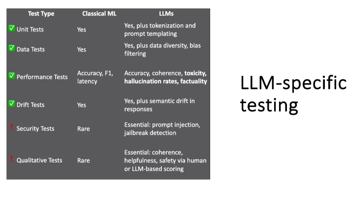
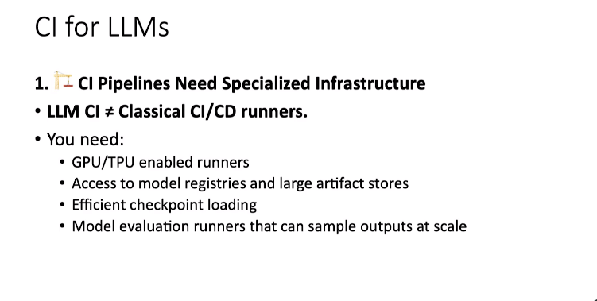

# MLOps for LLMs

Introduction to operations for Large Language Models(LLMs) also called as MLOps for LLMs.

**Objectives**

- Model Versioning for base models and fine-tuned variants, CI/CD specifics
- Accuracy, Performance vs Cost tradeoffs, Observability, Security & Governance (Bias, Toxicity, Explainability)

### Understanding LLMs

An LLM is defined as an advanced AI model trained on language datasets, which are primarily text data.

The model is engineered to predict the next token of text based on the current context captured in a "context window"

LLMs accept various forms of "multimodal input" such as text, images, audio, and video, which are collectively called "prompts"

To construct a response, an LLM can use several tools, including Browse the web, executing programs, and accessing a database or data store

### LLM Building Process

The process of building LLMs involves three main stages:
Pre-training (Stage 1): This involves training the model on massive datasets, such as data from the worldwide web, to create a foundational model. This stage is performed by large companies and typically happens on a yearly basis due to the scale and cost involved.

Fine-tuning (Stage 2): In this stage, a pre-trained foundational model is fine-tuned for specific tasks, such as creating a model for the insurance domain. The fine-tuned models can be produced more frequently, on a weekly or monthly basis.

Usage (Stage 3): This is the final stage where the LLM is used as an API, receiving prompts and providing programmatic responses, such as JSON outputs.

the capabilities of LLMs are widely publicized, but here our focus will be on operational aspects of working with them, which happens around the LLM.

The characteristics of classical machine learning (ML) models, deep learning models, and large language models (LLMs) across several key factors.

Training Time: Classical ML is fast, deep learning is slower, and LLMs, particularly during pre-training, take the longest, often weeks on GPU clusters.

Model Size: Classical ML models are small, deep learning models are large, and LLMs are extremely large. The speaker notes that this is a key factor in the distinction between proprietary and open models.

Data and Compute: LLMs demand "web-scale" datasets and require significant GPU support, unlike classical and deep learning models which have lesser requirements.

Task Flexibility: Classical ML models are task-specific, deep learning models have some generalization, but LLMs are known for their "general-purpose nature" and wide applicability, allowing them to perform various tasks like generating stories or code.

Explainability: Classical ML is the most explainable, deep learning has less explainability, and LLMs have "absolutely no explainability" beyond token prediction probabilities.

Inference Speed: Classical ML is very fast, deep learning is relatively fast, but LLMs are "significantly slow" in comparison, even with optimizations.

Security Risks: The video highlights that LLMs have a significantly larger "attack surface" with new risks such as prompt hijacking and data leakage, compared to classical and deep learning models.

Transferability: Classical ML has poor transferability, deep learning has moderate transferability, but LLMs have "high transferability" and can perform zero-shot or few-shot learning on new contexts with minimal guidance.

What is the difference between Open Source vs Open Weights LLM ?

| Feature                   | Open-Weight LLM                                                                                                                                                     | Open-Source LLM                                                                                                                                     |
| :------------------------ | :------------------------------------------------------------------------------------------------------------------------------------------------------------------ | :-------------------------------------------------------------------------------------------------------------------------------------------------- |
| **What is shared?** | Only the pre-trained model**weights** (parameters) are made public.                                                                                           | The model**weights**, **source code**, **training algorithms**, and often the **training data** are all publicly available. |
| **Transparency**    | **Low.** You can see the final, trained model but not the "recipe" used to create it. It's like receiving a compiled program without the source code.         | **High.** The entire process is transparent, allowing anyone to inspect, modify, and understand how the model was built and trained.          |
| **Reproducibility** | **Limited.** Without access to the training data and code, you cannot fully reproduce the model from scratch. You can only verify its performance.            | **High.** The entire training process can be replicated by others, which is vital for scientific research and ethical oversight.              |
| **Modification**    | You can fine-tune the model for specific tasks, but you cannot fundamentally change its architecture or retrain it from scratch using the original methodology.     | You have full control. You can modify the architecture, change the training algorithms, and adapt every aspect of the model to your needs.          |
| **Community**       | The community can use and fine-tune the model, but their ability to contribute to the core development is limited.                                                  | A vibrant community can contribute to every aspect of the project, from bug fixes and new features to documentation and ethical reviews.            |
| **Licensing**       | Often released under licenses that are permissive (e.g., Apache 2.0) but may have restrictions, such as commercial use limitations or requirements for attribution. | Adheres to traditional open-source principles (e.g., MIT, Apache 2.0), granting broad freedoms for use, modification, and redistribution.           |

### Key Challenges of LLMs

What are the key challenges in ML, DL and LLMs ?

The challenges of LLMs compared to classical machine learning, breaking them down by the three stages of LLM interaction: pre-training, fine-tuning, and usage.

#### 1. Pre-training Stage

* **Data challenges:** The process requires terabytes of diverse, high-quality text data, which is a significant and costly exercise that only a handful of large companies can undertake.
* **Computational resources:** Pre-training demands powerful, specialized hardware like GPU clusters and parallel training techniques to process massive datasets.

#### 2. Fine-tuning Stage

* **Control and Interpretability:** A key challenge is controlling the fine-tuned model's specific outputs without losing its inherent power to generalize to similar tasks with minimal guidance. It's difficult to guarantee that a fine-tuned model will produce explainable outputs or work on affiliated tasks.
* **Continuous Updates:** Fine-tuned models can become outdated quickly because the foundation models they are based on have a "view of the world as of a particular date".

#### 3. Usage Stage

* **Latency:** While human-scale latencies may seem acceptable, LLM inference speeds are significantly slower than classical ML models and can become a major issue when integrated into applications that require real-time processing.
* **Hallucination Risk:** Unlike classical ML's misclassification, LLMs can generate wrong but confidently stated answers, making it difficult to detect without external fact-checkers or verifiers.
* **Model Size:** LLMs are very large, which is why managed LLM services are popular and expensive.
* **Security and Abuse:** LLMs face new and numerous security risks, such as prompt injection and data leakage, which are far more prevalent than in classical ML pipelines .
* **Ethical and Bias Concerns:** The biases in LLMs are learned from the pre-training datasets, making them deeply embedded. Detecting and mitigating these biases requires addressing the issue at the data collection stage itself.

### Pre-Traning : Data Challenges

Note : Key operational items related to data and compute in the pretraining stage

There are alots of challenges involved in the pre-training stage of Large Language Models (LLMs), focusing primarily on data and compute

* **Low-quality or noisy data** : We know that LLMs rely on vast amounts of web data for pre-training, this data is often low-quality, noisy, and contains duplicates. Incorrect data can lead to the model learning fake relationships, toxicity, and biases, or even hallucinating facts. Thus we needed to mitigate such thing from the data using The mitigation strategy involving aggressive data cleaning, deduplication, filtering, and quality checks grounded in human-verifiable labels etc.
* **Biases and toxicity** : The data can contain embedded biases and toxicity, which, if not addressed, can worsen the problem and make the bias an inherent part of the model. To mitigate this, bias detection and toxicity filtering must be incorporated into the data sourcing pipeline from the beginning, often with a human feedback loop.
* **Data imbalance** : Web data is predominantly in the English language and has a strong leaning toward American English contexts, which can lead to data imbalance. This is problematic because half the world's population resides in regions like Southeast Asia and China, where social media usage is high, but this data is often not indexed for LLM pre-training. As a result, models trained on this data may not be proficient in other languages. For example, the video mentions a model assuming women in the medical field are nurses rather than doctors.
* **Leakage of Sensitive Information** : LLMs can inadvertently train on sensitive information, such as personal identifiable information (PII), from public repositories. This could result in intellectual property lawsuits or massive fines under regulations like GDPR. The mitigation strategy involves using PII scrubbing tools and carefully selecting curated data sources.
* **Outdated or Stale Data** : It's a challenge to keep foundation models updated with new information since retraining them is time-consuming and expensive. Retrieval-Augmented Generation (RAG) can help with this issue.
* **Engineering Challenges** : The video also covers the engineering bottleneck of processing data at a large scale. Data ingress can be very slow, causing GPU clusters to be idle while waiting for data . To mitigate this, big data engineering techniques and synthetic data can be used.

### Pre-Training : Compute Challenges

What are the challenges related to the compute resources during the pre-training stage of Large Language Models (LLMs).

* **Memory Bottlenecks:** The large model sizes and batch sizes can exceed the memory of a single GPU, leading to out-of-memory errors in a distributed cluster setup. To mitigate this, frequent checkpointing and compressed floating-point representations (using 16-bit instead of 32-bit) are recommended.
* **Checkpointing and Failure Recovery:** Checkpointing is highlighted as a critical practice to avoid significant loss of progress. The speaker emphasizes the need to save progress frequently to reliable, persistent storage so training can be resumed from the last checkpoint in case of failures.
* **Compute Inefficiency:** The  suboptimal data pipelines can lead to idle GPU time. This often happens when code is written in a way that doesn't leverage the distributed nature of the cluster. The solution is to use proper big data principles like data and model parallelism, and to optimize data loaders and I/O processes.
* **Network Bandwidth:** The distributed nature of LLM training means that multi-node communication can be a bottleneck. The training process is only as fast as the slowest node, so high-bandwidth, low-latency connections between machines are crucial.
* **Hyperparameter Sensitivity:** Incorrect hyperparameters, such as learning rates, can lead to wasted computational resources if the model fails to converge effectively. It is recommended to follow best practices and start with conservative settings before scaling up.
* **Storage Bottlenecks:** The massive datasets used in pre-training can cause storage issues. A mix of hybrid storage options, like using SSDs for frequent checkpoints and regular disks for other data, is suggested to prevent GPUs from being starved of data.

### Versioning in LLMs

Versioning of pretrained and finetuned LLMs, adapting git-flow to LLM development, and testing

How to apply the mlops techniques like data and model versioning, testing, CI/CD etc in LLM or do we needed some changes for need of LLM ?

or

how to apply best practices from classical machine learning (ML) to large language models (LLMs), focusing on versioning, CI/CD, and testing.

#### **Versioning for Foundation Models** :

These models are long-lived and multi-purpose, used across different teams and contexts.

* Versioning for these is similar to stable main branches in Git repositories.
* Data versioning for foundation models needs to be multi-modal, supporting text, video, audio, and images.
* Traditional change detection methods like modification time or checksums are not effective for non-textual data because small changes can be registered as an entirely new file.
* Given the massive size of the datasets and the extensive planning required for pre-training, the speaker recommends that dedicated data versioning tools may not be necessary. Instead, the lineage, checkpointing, and meticulous data curation process for these models should provide sufficient traceability.

#### Versioning for Fine-Tuned Models

* Fine-tuned models are task-specific and require a model-centric versioning approach.
* Unlike classical ML, where the focus is on versioning the code, it makes more sense to version the models themselves due to their large size.
* A critical aspect of fine-tuning is the regular update of data. This updated data is incremental and represents a regular data versioning exercise that can be performed.
* The versioning process for fine-tuned models involves versioning the entire model, including its lineage. This ensures a clear link between data updates, code changes, and the new fine-tuned model versions that are produced.
* The speaker provides a potential scenario where a base foundational model is fine-tuned weekly, with additional optimizations and new varieties being produced over time. All these variations result in new model versions.
* Tools like DVC (Data Version Control) are still useful in this context. The speaker also suggests adapting the Gitflow paradigm for ML projects to be used with fine-tuned models.

#### Adapting git-flow to finetuned models

how to adapt the GitFlow paradigm for fine-tuned Large Language Models (LLMs), a process that differs significantly from classical machine learning (ML) projects.

* **Applicability** : GitFlow is not recommended for foundational models because they are rarely updated. However, it is highly applicable for fine-tuned models.
* **Artifact Size** : For classical ML, the primary artifacts are code, which is typically in megabytes. For LLMs, the models themselves are large, so this must be considered when using GitFlow.
* **Tooling** : DVC (Data Version Control) can be used to checkpoint and version the large fine-tuned models, including their weights and hyperparameters. The code itself is managed in a standard Git repository.
* **Release Cycles** :
* Classical ML uses feature-driven releases, allowing for easy rollbacks to a stable branch.
* LLMs require continuous fine-tuning, and the cost of retraining is high. As a result, rolling back might be very expensive or impractical.
* **Storage** : While classical ML stores code in a repository (local or remote), LLMs use a combination of different storage systems. Code is stored in a Git repo, but the large models might be stored in dedicated model registries, which often have their own storage systems.
* **Branching** :
* Classical ML uses separate branches for features and bug fixes.
* For LLMs, additional branches may be created for new experiments like distillation, quantization, or LoRA (Low-Rank Adaptation).
* **Versioning** :
* In classical ML, version tags are attached to each release.
* For LLMs, it's more useful to attach semantic model tags, which helps in tracking which tag corresponds to which model.
* **Rollback Strategy** :
* GitFlow allows for easy rollback by simply checking out a previous release branch.
* For LLMs, a full redeployment might be necessary, and you may need to manage checkpoints yourself.
* **Governance** : In addition to standard governance practices like code reviews and CI/CD, LLM fine-tuning requires human-in-the-loop audits for bias checking, testing, and dataset tracking.

### Fine-Tuning : Testing

What are the challenges and methods for testing Large Language Models (LLMs) ?

#### Challenges of Testing LLMs

* **Nondeterminism:** Unlike traditional software, which produces consistent outputs, LLMs have inherent noise and variability. This means they can produce different answers for the same prompt, making it difficult to use deterministic testing methods.
* **Testing Creativity:** The process of an LLM predicting the next token and generating varied responses is similar to human creative thinking, making it difficult to test in a conventional, deterministic way.
* **Evolving Performance:** An anecdote is shared about GPT-3.5, which initially showed strong capabilities in areas like math and code generation but then regressed in performance on those same tasks in a later version. This highlights the importance of regression tests.

#### Recommended Testing Practices

* **Data Validation:** It's essential to validate data used for fine-tuning models to ensure quality and prevent data drift .
* **Model Performance Tests:** For factual or numerical data, you can measure accuracy by comparing the LLM's output against known correct answers.
* **Regression Tests:** It is crucial to perform regression tests to ensure that new versions of a model do not perform worse on tasks that previous versions excelled at.
* **Online Testing:** Unlike software, which can be certified in a CI cycle and be expected to perform the same in production, LLMs need continuous online testing in a production environment.
  * Tests should screen for issues like hallucination, toxicity, and consistency in real-time as the model generates responses.
  * This is important because prompts from end-users can cause the model to behave unpredictably, a scenario that may not have been captured in the CI stage.
* **CI/CD is a must:** The speaker emphasizes that Continuous Integration and Continuous Deployment (CI/CD) is essential for LLM fine-tuning.

Our focus will be on various testing practices essential for LLMs, adapting the concepts from classical ML and software testing.

#### Types of Tests for LLMs

* **Unit Tests:** LLMs require specific tests for things like prompt templating and tokenization to ensure the prompts are structured correctly and text is being chunked properly.
* **Data Tests:** These are crucial for ensuring data quality and preventing issues like bias, underrepresentation, or overrepresentation . The speaker emphasizes the need to check for biases and maintain data balance.
* **Performance Tests:** It is possible to measure traditional metrics like accuracy, F1 score, and recall for LLMs on factual questions where a correct answer is known.
* **Drift Tests:** These are important for detecting both data drift and, more uniquely to LLMs, "semantic drift," which refers to changes in the meaning of the responses over time.
* **Security Tests:** The speaker notes that security testing is vital for LLMs, as the open nature of language models presents a much larger attack surface compared to structured languages.
* **Qualitative Tests:** These are essential for evaluating the model's helpfulness and safety. The speaker provides an example of a chatbot providing a factually correct but completely unhelpful answer, stressing the importance of the model meeting the user's intent. He also mentions the need to test for safety to ensure the model does not provide dangerous instructions.

Note : In LLM full automation might not be possible, and a "human in the loop" is necessary to provide feedback for testing.

### CI for LLMs

the specialized Continuous Integration (CI) process for Large Language Models (LLMs) and compares it to classical machine learning (ML).

#### Specialized Infrastructure for LLMs CI

* LLMs require specialized infrastructure, such as GPUs or TPUs, due to the different type of compute needed.
* Model registries are necessary to store and version large models, and artifact stores are much larger than typical feature stores.
* The infrastructure must be able to efficiently load checkpoints and have access to SSDs for faster loading.
* Evaluation runners need to be able to sample outputs at scale to verify accuracy, consistency, and check for hallucinations, all as part of the CI stage itself, which is a significant change from classical ML.

#### Adjusting Reproducibility Expectations

* Unlike classical ML, where retraining a model yields nearly identical outputs, LLMs can have significant output deviations from slight changes in prompt templates, data sets, or hyperparameters.
* To mitigate this, it's important to track points of randomness and set the random state to a constant value for testing.
* Tracking checkpoints and hyperparameter sensitivity is also crucial, and it's necessary to accept some degree of tolerance for output variations.
* The method for modeling the output during testing should be domain-specific.

#### Prompt Engineering in the CI Lifecycle

* Prompt engineering is a critical interface for LLMs and must be an integral part of the CI cycle.
* Prompts should be treated like code, meaning they need to be versioned and compared across different fine-tuning iterations.
* The CI process should include testing for prompt syntax correctness, verifying output format consistency, and detecting prompt drift.

#### Artifact Management

* Due to the large size of fine-tuned models and other artifacts, the CI process needs to be integrated with model registries and cloud repositories.
* It's important to efficiently cache these artifacts to support multiple jobs.
* The CI process must also track the lineage from the fine-tuned model back to the base model, including where the base model was downloaded from and how it was set up.

### CD for LLM Models

how Continuous Deployment (CD) can be applied to large foundation models.

#### CD for Foundation Models

Foundation Models: For foundation models, which are like core software components with downstream dependencies, the CD process should prioritize creating stable, safety-critical releases. The git flow main branch is recommended as a suitable vehicle for disseminating these models.

#### CD for Finetuned Models

Fine-tuned Models: Fine-tuned models, which are built on top of foundation models, are released more frequently. Here, the focus of the CD should be on speed and iteration, similar to conventional software development.

Gitflow: The video suggests using a Gitflow technique adapted for LLMs. The main branch is used for foundation models, while the release branch is used for fine-tuned models. Experimental fine-tuning variations can be worked on in separate ephemeral branches before being merged back into the release branch via a merge or pull request

CI for LLMs, CD for foundation and finetuned models, Typical LLM usage patterns

### Usage of Deployed Models

A common misconception is that Large Language Models (LLMs) learn and update themselves as users interact with them. However, this is not the case. The core weights of the model are not updated during a conversation; instead, the LLM uses a **context window** to store and retrieve new information provided by the user.

#### Why LLMs Can't Update Themselves on the Fly

* **Frozen Weights** : LLMs are pre-trained and their weights are frozen during inference. They do not have an internal mechanism for self-improvement or learning from new interactions in real time.
* **Fine-Tuning Cycle** : To incorporate new data, an LLM must go through a complete fine-tuning cycle, which is a resource-intensive and time-consuming process.

#### What LLMs Can Do with New Data (Online Operations)

While LLMs cannot update their core weights on the fly, they can still perform several "online operations" by leveraging the information in their context window:

* **Pattern Recognition** : LLMs can spot trends and extrapolate from new examples given within a few-shot context.
* **Reasoning with Examples** : They can use a few-shot examples to gain context and perform reasoning tasks.
* **Predicting Trends** : To a limited extent, they can predict trends as long as the information fits within the context window, allowing for generalization.

#### LLM Usage : Lookup + Orchestration is common

how to augment the limitations of LLMs when working with new data by using common patterns for data lookup and orchestration.

#### Data Lookup and Orchestration

* **Data Pipeline Integration** : An LLM-powered shopping agent needs real-time inventory data, which changes too frequently to be part of the model's fine-tuning cycle. The correct approach is to integrate the LLM's tooling capabilities with a data pipeline that connects to the inventory database. This makes the LLM usage a facet of a broader software product that includes data lookup from a database.
* **Chunking Prompts and Responses** : To effectively retrieve information from large documents, like an insurance policy, the document needs to be "chunked up" and stored in a vector database for Retrieval Augmented Generation (RAG).
* **Context Assembly** : This is a data engineering step where various components are assembled to create a single context for the LLM to answer a prompt. These components include the context window, the user query (prompt), instructions from prompt templates, and data chunks from RAG or other lookups.
* **Anonymization and Masking** : This is a necessary step because prompts and responses can accidentally include personally identifiable information (PII). Appropriate engineering is required to handle this based on the context.
* Conclusion that using an LLM is similar to using any other API, but with specific considerations. The CI/CD pipeline for a product using LLMs must account for factors like response variation and the need for integrations across various data sources through processes like chunking, tokenization, and assembly.

#### Example : Customer Service Agent

How to use an LLM as a customer service agent for a bank.

How an LLM-powered agent could answer a customer's question, such as why a specific fee was charged. To do this, the agent needs to access several types of information:

* **Authentication:** The agent must first confirm it is speaking with the correct customer to prevent unauthorized information access.
* **Customer Data:** The agent needs to fetch the customer's recent interaction data from a database.
* **Bank Policies:** It also needs to access bank product information and policies for resolving customer questions

how these different information sources are integrated into the system:

* An **ID module** is exposed as an API that the LLM uses for authentication.
* The LLM must be able to generate and execute SQL queries to fetch customer interaction data from a database.
* Bank product and policy documents (like PDFs) are processed using a Retrieval-Augmented Generation (RAG) approach. The documents are chunked and made available for retrieval when needed.

In conclusion that building a system with an LLM agent requires integrating all these components like a regular software system.

### Building Fine-tuned model

1. Data processing - data and it's format is right.
2. LLM
3. CI/CD aspect of both pre-training and finetuning
4. After in Production, The usage of LLM in Inferencing
5. Considering all the aspects of the running LLM in production
   Building a fine-tuned model and focusing on data processing to ensure quality and proper formatting for LLM architectures

CI/CD (Continuous Integration/Continuous Deployment) aspects for LLMs, specifically the patterns related to pre-training and fine-tuning before an LLM is deployed for inferencing

### LLM in Production : Measuring LLM Accuracy

What are the best practices and emerging topics in the field

What are the consideration for running LLMs in a production environment and it is the most a critical aspect for a comprehensive understanding of LLM ops

**Measuring Accuracy :**
The accuracy as one of the most important attributes of an LLM that defines its usefulness. Accuracy is measured by whether the model's responses are usable, correct, and relevant to the task. Unlike classical machine learning, where accuracy is mathematically verifiable, LLMs have a natural language interface that introduces variability and uncertainty.

**Three Types of LLM Evaluations**
To understand and measure accuracy, three types of evaluations:

Benchmarks: You can use either general-purpose or domain-specific benchmarks to test the model's performance.

Human Evaluation: A human reviews the LLM's output to verify if it meets expectations or is factually accurate.

LLM as a Judge: Other LLMs can be used to evaluate and critique the output of the current model.

#### LM Evaluation Harness

#### Imporving Fine-tuned LLM Accuracy

Improving LLM Accuracy
There are four effective ways to improve the accuracy of a fine-tuned LLM:

Post-training: A catch-all term for techniques applied after a fine-tuned model is produced to improve its accuracy without changing its weights.

Supervised fine-tuning: Providing small sets of ideal input-output pairs to serve as a strong anchor for the LLM to learn from.

Direct preference optimization: Giving the LLM multiple possible outputs but indicating which one is preferred to guide its learning.

Reinforcement learning: Using feedback to reward the model for desired behavior.

Prompt engineering: This involves using well-structured prompts. The speaker will discuss this in a later section of the video.

Lookups from RAG documents: Using Retrieval-Augmented Generation (RAG) to fetch information from known, factually correct sources. The LLM uses this information in its context window to provide accurate answers, thereby controlling hallucinations and improving overall accuracy.

Verification layers: Adding separate layers or APIs that check an LLM's response for compliance with factual accuracy or security policies. The speaker will elaborate on this in a subsequent section.

#### Prompt Engineering

Prompt engineering, a method for improving LLM accuracy by treating prompts with the same seriousness as code.

**Prompt Engineering Concepts**
It emphasizes that prompts are not just unstructured text; they are powerful tools that can significantly influence an LLM's behavior. Therefore, they should be treated with the same engineering principles as code, including versioning, control, and using DevOps and CI/CD practices. A well-tuned prompt is also closely tied to the specific model it's running on, meaning the same prompt may perform differently on another fine-tuned model.

**Engineering for Prompts**
To manage and control prompts effectively, the video suggests using prompt templates. These templates provide a structured framework for prompts while allowing for the parameterization of specific data points. This helps control the alignment between the prompt and the backend model, preventing the use of a prompt designed for one model on another. Templates also enable enhanced security control and allow for the tracking of usage and responses for governance purposes.

DSPy as an open-source project that provides a Domain-Specific Language (DSL) for prompts. This framework aims to add structure to prompts without sacrificing their natural language feel, allowing for better optimization and control

Declarative - What needed to be done
Procedural - How needed to be done

Once the prompt is defined using these structures then it can organize those structure for the prompt in such a way that it is optimized prompt.

#### Verification Layer

**Verification Layers**
Purpose: The verification layers as a method to improve LLM accuracy. This is a separate layer that takes the LLM's response and checks it for compliance with factual accuracy or security policies. This layer can act as an API that invokes the LLM, processes the response, and then provides a verified output.

Methods of Verification: There are several methods for verification, including:

1. RAG Lookup: Performing a lookup against Retrieval-Augmented Generation (RAG) documents to ensure the LLM's response is factually correct.
2. Critique LLM: Using a second, more powerful LLM to critique the response of the primary LLM for factual inconsistencies.
3. Static Rules: Using static rules to check the format or output of the LLM's response.

An example of a critique LLM is given, where a verifier LLM checks a primary LLM's answer against an original PDF to verify its factual accuracy

#### Example - usage of critique LLMs

